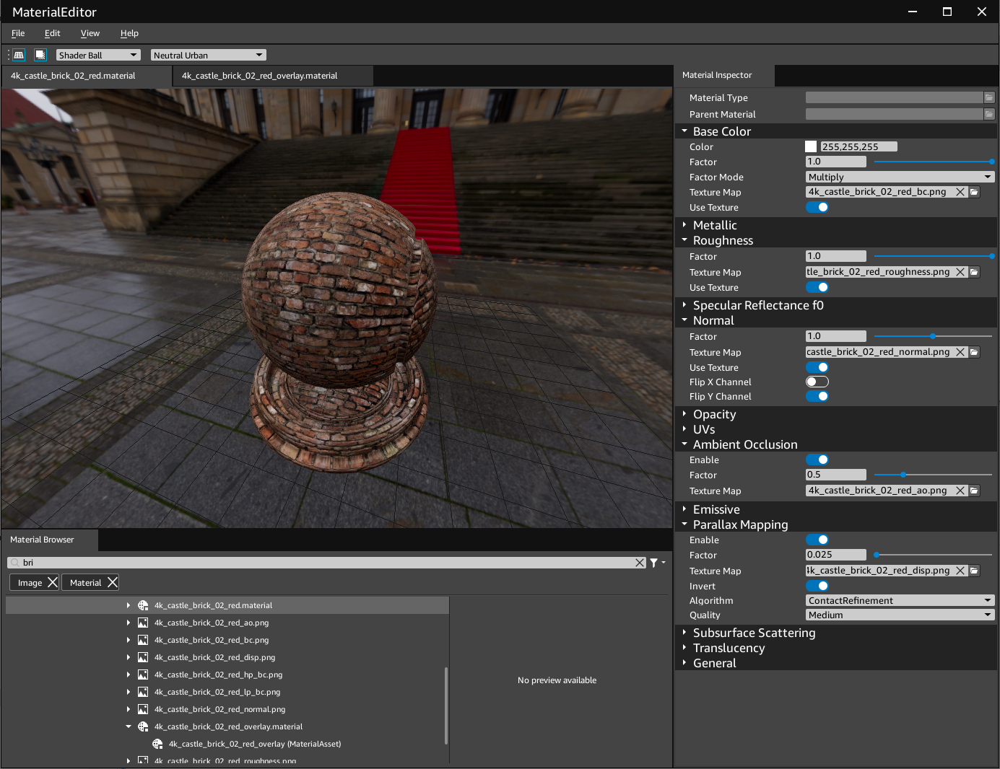

# Creating a StandardPBR Material
This is a brief walk-through on manually creating a material. Atom uses 'physically based' materials (PBR). This shading model is more visually accurate and eaily represents photoreal materials from the real world. 

This tutorial covers the following concepts:
- Material file structure and texture files
- Using filemasks in texture file names
- Creating a material using a Material Editor

## Before starting
A material can have multiple texture channels: basecolor, normal map, roughness, etc. All ofthe texture channels work together to create the overall look of the material. [WRITER NOTE: How do they work together? E.g. do they overlap each other. Is there a calculation that combines them together?] There are numerous external tools that can help design the texture channels of a material, such as Substance Designer, or [Materialize](http://boundingboxsoftware.com/materialize/). In this tutorial, we use ready-made materials from [Texture Haven](https://texturehaven.com/). 

### Download texture files
In this example, we use a [material](https://texturehaven.com/tex/?t=castle_brick_02_red) from Texture Haven. When downloading, make sure to click "All Maps" to download all texture channels that make up this material.

After downloading, move and extract the zip file (`.zip`) to the directory, `<root-directory>/Assets/Materials/TextureHaven/`.

We use the following files as our input texture channels:
-  castle_brick_02_red_ao_1k (ambient occlusion)
-  castle_brick_02_red_diff_1k (diffuse, base color)
-  castle_brick_02_red_disp_1k (displacement)
-  castle_brick_02_red_nor_1k (normal)
-  castle_brick_02_red_rough_1k (roughness)

### Rename texture files
To make sure these texture files work with the Material Editor, it's important to apply its filemask. A filemask is the suffix at the end of a file's name that indicates its associated texture channel. The filemask allows the asset processor to correctly convert this image type into its runtime format. 

We rename the following files to properly apply a filemask:
- castle_brick_02_red_ao_4k &rarr; castle_brick_02_red_ao
- castle_brick_02_red_diff_4k &rarr; castle_brick_02_red_basecolor
- castle_brick_02_red_disp_4k &rarr; castle_brick_02_red_disp
- castle_brick_02_red_nor_4k &rarr; castle_brick_02_red_normal
- castle_brick_02_red_rough_4k &rarr; castle_brick_02_red_roughness

## Create material with Material Editor
At this point, you have downloaded the texture files needed to create your material. You have also renamed them to contain the necessary filemasks.  Continue to the following steps to create a material using the Material Editor:
1. Open the Material Editor by running `MaterialEditor.exe` from the folder `<root-directory./dev/windows_v2019/bin/profile`.
2. Create a new StandardPBR material by clicking `File > New > StandardPBR`. This will open the file browser and prompt you to save the new file. [WRITER NOTE: Will talk to Jonny about file locations for materials.]
3. In the Inspector tab, you can verify the material type is StandardPBR by checking the `Material Type` property in the `Details` property group. 
4. Browse and load each texture file into the `Texture Map` property under the texture's associated property group. Make sure to enable the `Use Texture` property. Depending on the property group, additional properties may appear to further configure the property group. 

    The textures are loaded into their associated property group in the following way. 
    
   - **Base Color**: castle_brick_02_red_basecolor
   - **Roughness**: castle_brick_02_red_roughness
   - **Normal**: castle_brick_02_red_normal
   - **Ambient Occlusion**: castle_brick_02_red_ao
   - **Parallax Mapping**: castle_brick_02_red_disp

    *Note: The downloaded normal map is flipped. To flip it back, enable the `Flip Y Channel` property.*

    For more information on property groups in the Material Editor, see ___. [*WRITER NOTE: TODO*]

You've successfully created a new StandardPBR material! The following figure shows the property settings and the expected material outcome. [WRITER NOTE: How should I incorporate and introduce this image?] 

<!--
## Extra Credit 
Create a high pass texture!  

[WRITER NOTE: TODO. Won't do until after March 9. See https://wiki.agscollab.com/pages/viewpage.action?spaceKey=ATOM&title=Create+a+StandardPBR+Material]
-->