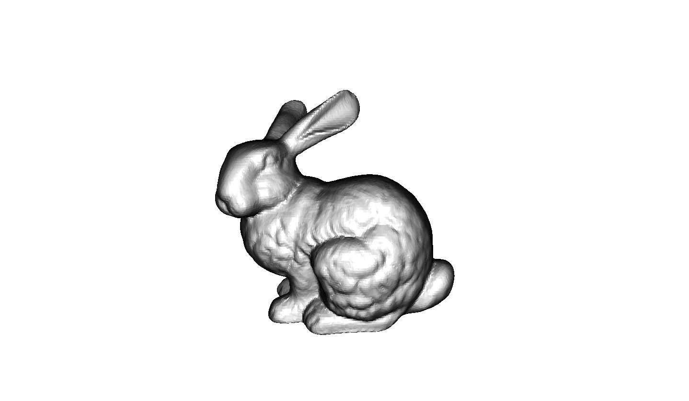

# What is Atom?

Atom is a modular, data-driven, and multi-threaded rendering engine. With Atom, you can create content using the latest rendering technology. Atom supports modern rendering pipelines such as Forward+ and Deferred rendering. Its rendering pipeline is fully data driven, enabling developers to modify or replace key components with minimal code change. Atom’s multi-threading support allows rendering features to run parallel on both the CPU and GPU, taking advantage of all computing resources. Atom is built on multiple industry-standard 3D graphics APIs and features a modular design that makes it easy to expand support for additional platforms. 

Atom also has the following advantages: 

* Its high-level rendering features are separated from its low-level API, allowing developers to add or customize rendering features without touching low-level code.
* It is optimized with a cluster forward+ shading model. Each process of the shading model is componentized into discrete passes, allowing flexibility to adopt future shading models.
* Its modular design separates key aspects of the renderer into discrete units, allowing developers to move to a different shading model such as a full physically-based or toon-based shading model. 

## Rendering pipeline

Atom’s rendering pipeline is split into several core systems, each communicating with one another to use the power of the GPU to process and display graphics onto the screen. Whether its designing materials, livening your 3D environment with graphics features, or displaying your project across multiple views — it’s important to understand the fundamental concepts underlying Atom’s architecture. Atom’s architecture includes the Rendering Hardware Interface (RHI), the Render Pipeline Interface (RPI), and the graphics features. 

Atom’s rendering pipeline is split into several core systems, each communicating with one another to use the power of the GPU to process and display graphics onto the screen. Whether its designing materials, livening your 3D environment with graphics features, or displaying your project across multiple views — it’s important to understand the fundamental concepts underlying Atom’s architecture. Atom’s architecture includes the Rendering Hardware Interface (RHI), the Render Pipeline Interface (RPI), and the graphics features. 

**RHI**
At the low level, the RHI talks directly to different graphics APIs and hardware. It provides abstract layer of APIs to expose GPU's functionality so high level graphics features don't need to use platforms related graphics APIs.

For more information on the RHI, see [RHI](../architecture/rhi/intro.md). 

**RPI**
The RPI is the data-driven layer that makes the rendering pipeline customizable. It also defines fundamental graphics assets such as Images, Materials, and Shaders. Furthermore, it defines Feature Processors which implements most of the high-level graphics features and enable their interaction with the render pipeline. When making changes to the the rendering pipeline or adding and editing features, developers and engineers will work with the RPI C++ API. 

For more information on the RPI, see [RPI](../architecture/rpi/intro.md). 

**Shader Build System**
In Atom, shaders are written in the Amazon Shading Language (AZSL), an extended version of HLSL. Shaders are compiled by the AZSL compiler. Then, materials reference these shaders which ultimately describes how to render a mesh. 

For more information on shaders and materials, see [Shader System](../architecture/shaders/intro.md) and [Material System](../architecture/materials/intro.md). 

**Features**
As a part of the renderer, Atom provides built-in graphics features. Most graphics features are implemented using Feature Processor interfaces which are defined in the RPI. For example, the RPI defines the Mesh Feature Processor which implements static and dynamic meshes. Other features live outside of feature processors and are instead implemented through passes and shaders. For example, physically-based rendering. Atom integrates many features into O3DE through the Atom Gem, introducing components such as lighting, camera, and mesh. 

For more information on the features, see [Features and Feature Processors](../architecture/features/intro.md). 

This architecture is designed for modularity, allowing developers to activate only the graphics features they need. It also allows developers to easily build additional graphics features on top of the RPI. 

## Common Workflows
Atom can elevate your project’s rendering capabilities and energize you and your whole team to push the limits of creation and innovation. Depending on your role, here are some common workflows you’ll encounter when working with Atom:

* **Technical artists** can use Atom to Create new materials easily through the Material Editor application, or with more control and detail through JSON files. With Atom’s raytracing technology and physically-based rendering materials, artists are empowered to create accurate, real-life materials. 

* **Game developers** can use Atom’s collection of rendering features to enhance many aspect of their game such as lighting, mesh rendering, and post-processing effects. Atom is integrated into O3DE, a game engine where game developers can create AAA games. 

* **Rendering engineers** can configure Atom’s rendering pipeline, add new rendering passes, and create new rendering features using Atom’s C++ API. 

## First Steps  
Ready to get started? These first steps will get you up and running with Atom.

**1. Setup and installation**  
Setup and install Atom on PC, Android, Mac, and iOS platforms. You can begin exploring Atom’s features and capabilities through its built-in BaseViewer application, through the O3DE game engine, or by building from source. 

For more information on setting up and installing Atom, see [Setup and Installation](../setup/installing-atom.md) section of this guide. 

**2. Begin creating with Atom**  
You can learn more about Atom in the next sections of this guide. 

* **[Get Started](../get-started/_index.md)**: Write your first material and shader, and set up a 3D environment in O3DE using Atom.
* **[BaseViewer Samples](../baseviewer/_index.md)**: Explore Atom’s rendering features through a series of samples, such as global illumination and multi-scene rendering. 
* **[Tutorials](../tutorials/_index.md)**: Interact with a collection of tutorials on rendering with Atom.
* **[Atom core systems](../architecture/_index.md)**: Dive into Atom’s rendering pipeline and learn about each core system and how they work together. 
* **[Contribution](../contributing/_index.md)** : Join the Atom community and see how you can contribute. 

