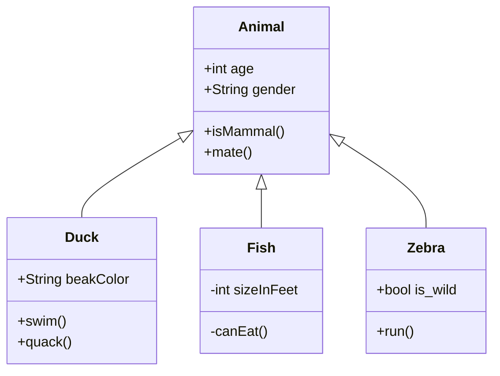

The **Open 3D Engine (O3DE)** website includes support for the following tools that can assist with the specialized formatting needs of some O3DE documentation.

## Mathematical formulas in TeX and MathML {#math-formulas}

You can embed mathematical formulas using TeX and MathML input formats. Refer to the [MathJax documentation](https://docs.mathjax.org/en/latest/index.html) for more information on how to use the MathJax version 3.0 display engine.

**Example Usage**

```markdown
$$\left( \sum_{k=1}^n a_k b_k \right)^2 \leq \left( \sum_{k=1}^n a_k^2 \right) \left( \sum_{k=1}^n b_k^2 \right)$$
```

**Example Output**

$$\left( \sum_{k=1}^n a_k b_k \right)^2 \leq \left( \sum_{k=1}^n a_k^2 \right) \left( \sum_{k=1}^n b_k^2 \right)$$

## Diagrams using Mermaid {#diagrams}

You can create a variety of diagrams and other visualizations from within Markdown code blocks that will render using the Mermaid diagram tool. Refer to the [Mermaid documentation](https://mermaid-js.github.io/mermaid/) to learn about the various supported diagram types and their usage syntax.

### Example: Flowchart

````

````

**Output**


### Example: UML Class Diagram

````

````

**Output**


