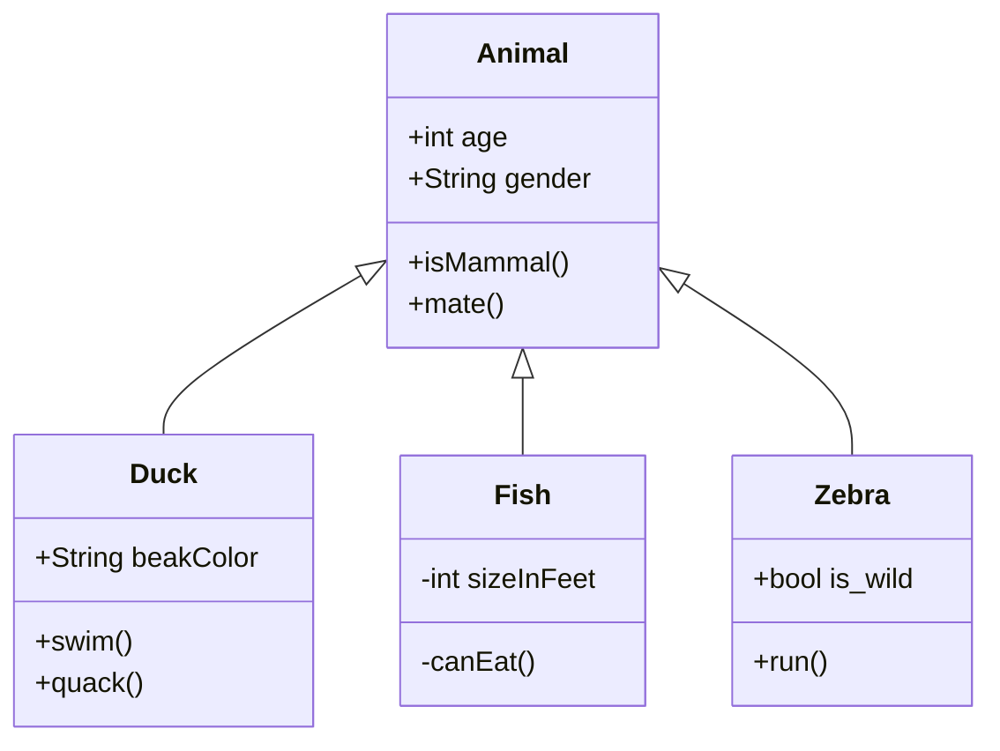

The O3D community needs your help in documenting and explaining the inner workings and intra-workings of the modular, open source, 3D simulation engine that is **Open 3D Engine (O3DE)**. In this topic, you will learn what to include in your contributions to this guide, where to place them in the directory structure, and what tools are supported on the website to help you best visually present your content.

## What to contribute and where

O3DE is a complex software product with many working parts. Just as an automobile comes with a user guide for drivers and a service manual for mechanics, O3DE benefits from having both a user guide for users and an engine guide for engine developers. The **Engine Developer Guide** is a place to document the architectural concepts that are too long or too broad for source code comments, and which might be difficult to represent using words alone.

The following `engine-dev` subdirectories are home to specific collections of content that would make excellent contributions to this guide:

* `architecture` - Conceptual content and diagrams that explain the overall architecture within the engine, explaining design decisions and execution flow.
* `frameworks` - Deeper dives into the design and usage of core libraries including `AzCore` and `AzFramework`, and specialized libraries such as `AzNetworking`.
* `gems` - Conceptual content and diagrams that explain the overall architecture of a Gem, explaining design decisions and execution flow.
* `assets` - A developer's look at the design of the asset system, including anything developers might need to know when extending or modifying the system.
* `tools` - Conceptual content and diagrams that explain the overall architecture of specific tools, explaining design decisions and execution flow.

Conceptual topics often benefit from the following type of coverage and visual aids:

* Architectural overviews and explanations of design choices.
* Execution flow, with flowchart diagrams to help visualize.
* Code map tables and UML class diagrams to document C++ classes.
* Debugging tips.
* Testing tips and examples.
* Scripts and other command line developer tools, with usage tips and examples.


The [o3de.org](https://o3de.org) website supports the Mermaid diagram tool, which uses text syntax inside of Markdown code blocks to render diagrams and visualizations. To learn more about creating diagrams with Mermaid, refer to [Creating flowcharts and class diagrams in Markdown](#diagramming-tools).


## Linking to source code

When linking to source code on GitHub -- especially when linking to a block of code within a file -- a good best practice is to use permalinks. Documentation is a snapshot in time, and a permalink to a specific commit preserves this concept for linked source code.

#### Creating file permalinks

To obtain permalinks for a file in a GitHub repo, navigate to the **Code** tab and open the file, then choose **Copy permalink** from the ... menu:


To embed the link, use the standard Markdown link format.

**Example**

Link: `[SettingsInterface](https://github.com/o3de/o3de/blob/69dbcd08a56539315bfb0472984daf0f46e7a966/Code/Tools/ProjectManager/Source/SettingsInterface.h)`

Output: [SettingsInterface](https://github.com/o3de/o3de/blob/69dbcd08a56539315bfb0472984daf0f46e7a966/Code/Tools/ProjectManager/Source/SettingsInterface.h)

#### Creating line block permalinks

To obtain permalinks for specific lines of code in a file in a GitHub repo:

1. Navigate to the **Code** tab and open the file.
1. Click on the first line number in the block.
1. Shift + click on the last line number in the block.
1. Choose **Copy permalink** from the ... menu to the left of the first line number:


**Example**

Link: `[SettingsInterface::Get](https://github.com/o3de/o3de/blob/69dbcd08a56539315bfb0472984daf0f46e7a966/Code/Tools/ProjectManager/Source/SettingsInterface.h#L31-L44)`

Output: [SettingsInterface::Get](https://github.com/o3de/o3de/blob/69dbcd08a56539315bfb0472984daf0f46e7a966/Code/Tools/ProjectManager/Source/SettingsInterface.h#L31-L44)

#### Using simple links

If you are linking to an entire file and are reasonably certain its filename will not change, it is acceptable to use a shorter, simple link instead.

**Example**

Link: `[EngineInfo.h](https://github.com/o3de/o3de/blob/development/Code/Tools/ProjectManager/Source/EngineInfo.h)`

Output: [EngineInfo.h](https://github.com/o3de/o3de/blob/development/Code/Tools/ProjectManager/Source/EngineInfo.h)

## Formatting tools

To help visualize your concepts, the following formatting tools are supported on the [o3de.org](https://o3de.org) website.

### Creating flowcharts and class diagrams in Markdown {#diagramming-tools}

You can create a variety of diagrams and other visualizations from within Markdown code blocks that will render using the Mermaid diagram tool. Refer to the [Mermaid documentation](https://mermaid-js.github.io/mermaid/) to learn about the various supported diagram types and their usage syntax.

#### Example: Flowchart

````

````

**Output**


#### Example: UML Class Diagram

````

````

**Output**


### Mathematical formulas

You can embed mathematical formulas using TeX and MathML input formats. Refer to the [MathJax documentation](https://docs.mathjax.org/en/latest/index.html) for more information on how to use the MathJax version 3.0 display engine.

**Example Usage**

```markdown
$$\left( \sum_{k=1}^n a_k b_k \right)^2 \leq \left( \sum_{k=1}^n a_k^2 \right) \left( \sum_{k=1}^n b_k^2 \right)$$
```

**Example Output**

$$\left( \sum_{k=1}^n a_k b_k \right)^2 \leq \left( \sum_{k=1}^n a_k^2 \right) \left( \sum_{k=1}^n b_k^2 \right)$$

## General information on contributing

For more general information on contributing to documentation, including a detailed style guide, more formatting options, and information on the process of submitting your contribution, refer to the docs section of the [Contributing Guide](/docs/contributing/to-docs/).
