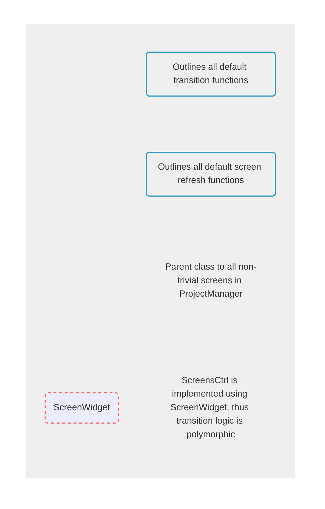


This information is for developers of the **Project Manager** tool. If you're a user working with Project Manager, please refer to the [Project Manager User Guide](/docs/user-guide/project-config/project-manager).



Click on a node to open the relevant source code for that node.


```mermaid

graph TD
    classDef PlainTextNode fill:#0000, stroke:#0000, stroke-width:0px, text:#0000
    classDef LinkTextNode fill:#0000, stroke:#2998c4, stroke-width:2px
    classDef TextNode fill:#1111, stroke:#0000, stroke-width:0px, text:#0000

    subgraph ProjectManager [ ]
        direction LR
        subgraph node1 [ ]
            a1(main.cpp)
            b1(Entry point of the Project Manager. Runs QApplication Loop)
        end
        
         subgraph node2 [ ]
            a2(Application)
            subgraph node2_sub1 [ ]
                direction TB
                b2(Initializes name, domain, log path, attributes, and starts QApplication with icon)
                c2(Sets python bindings)
                d2(Gets command line set to project path, registers engine, and sets starting project screen)
                e2(Starts ProjectManagerWindow)
                f2(Loads ProjectManager.qss stylesheet)
            end
            
        end

        subgraph node3 [ ]
            a3(ProjectManagerWindow)
            subgraph node3_sub1 [ ]
                direction TB
                b3(Set as MainWindow)
                c3(Creates Screen Controller and constructs all relevant UI screens of Project Manager)
                d3(Projects Screen set as first screen)
            end
        end

        subgraph node4 [ ]
            a4(ScreensCtrl)
            subgraph node4_sub1 [ ]
                direction TB
                b4(Handles screen transition and management. Star of the show)
            end
        end

        subgraph node5 [ ]
            a5(ScreenFactory)
            subgraph node5_sub1 [ ]
                direction TB
                b5(Helper class mapping ProjectManagerScreen enums to ScreenWidget child classes)
            end
        end
    end

    a1-->a2-->a3-->a4-->a5---EEE[ ];

    style EEE fill:#0000, stroke:#0000, stroke-width:0px, text:#0000
    linkStyle 4 stroke:#0000,stroke-width:0px;

    b2---c2---d2---e2---f2
    linkStyle 5 stroke:#0000,stroke-width:0px;
    linkStyle 6 stroke:#0000,stroke-width:0px;
    linkStyle 7 stroke:#0000,stroke-width:0px;
    linkStyle 8 stroke:#0000,stroke-width:0px;

    b3 --- c3 --- d3;
    linkStyle 9 stroke:#0000,stroke-width:0px;
    linkStyle 10 stroke:#0000,stroke-width:0px;

    class node1 TextNode
    click a1 "https://github.com/o3de/o3de/blob/development/Code/Tools/ProjectManager/Source/main.cpp" _blank
    class b1 LinkTextNode
    click b1 "https://github.com/o3de/o3de/blob/development/Code/Tools/ProjectManager/Source/main.cpp#L12" "main.cpp entry point" _blank
    
    class node2 TextNode
    click a2 "https://github.com/o3de/o3de/blob/development/Code/Tools/ProjectManager/Source/Application.h" _blank
    class node2_sub1 PlainTextNode
    class b2 LinkTextNode
    click b2 "https://github.com/o3de/o3de/blob/development/Code/Tools/ProjectManager/Source/Application.cpp#L38-L74" _blank
    class c2 LinkTextNode
    click c2 "https://github.com/o3de/o3de/blob/development/Code/Tools/ProjectManager/Source/Application.cpp#L76-L118" _blank
    class d2 LinkTextNode
    click d2 "https://github.com/o3de/o3de/blob/development/Code/Tools/ProjectManager/Source/Application.cpp#L120-L145" _blank
    class e2 LinkTextNode
    click e2 "https://github.com/o3de/o3de/blob/development/Code/Tools/ProjectManager/Source/Application.cpp#L147" _blank
    class f2 LinkTextNode
    click f2 "https://github.com/o3de/o3de/blob/development/Code/Tools/ProjectManager/Source/Application.cpp#L276-L289" _blank


    class node3 TextNode
    click a3 "https://github.com/o3de/o3de/blob/development/Code/Tools/ProjectManager/Source/ProjectManagerWindow.h" _blank
    class node3_sub1 PlainTextNode
    class b3 LinkTextNode
    click b3 "https://github.com/o3de/o3de/blob/development/Code/Tools/ProjectManager/Source/ProjectManagerWindow.cpp#L17" _blank
    class c3 LinkTextNode
    click c3 "https://github.com/o3de/o3de/blob/development/Code/Tools/ProjectManager/Source/ProjectManagerWindow.cpp#L31-L47" _blank
    class d3 LinkTextNode
    click d3 "https://github.com/o3de/o3de/blob/development/Code/Tools/ProjectManager/Source/ProjectManagerWindow.cpp#L49-L60" _blank

    class node4 TextNode
    click a4 "https://github.com/o3de/o3de/blob/development/Code/Tools/ProjectManager/Source/ScreensCtrl.h" _blank
    style a4 fill:#f9f,stroke:#76c4e2,stroke-width:4px
    class node4_sub1 PlainTextNode
    class b4 PlainTextNode

    class node5 TextNode
    click a5 "https://github.com/o3de/o3de/blob/development/Code/Tools/ProjectManager/Source/ScreenFactory.cpp" _blank
    class node5_sub1 PlainTextNode
    class b5 LinkTextNode
    click b5 "https://github.com/o3de/o3de/blob/development/Code/Tools/ProjectManager/Source/ScreenDefs.h#L16-L33" _blank

    class ProjectManager PlainTextNode
    
```

## ScreenWidget

