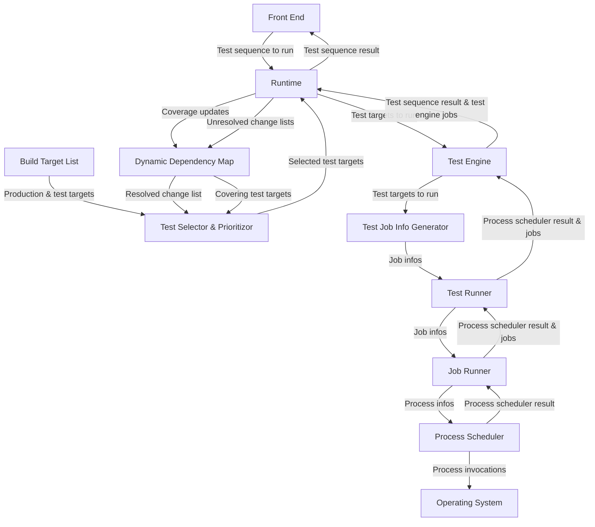

The **Test Impact Analysis Framework** (TIAF) is the implementation of change-based testing using a technique called [Fast Test Impact Analysis](https://www.youtube.com/watch?v=mMzL1UCr0OE) for optimizing lead time of Automated Review. The TIAF currently supports both native (C++) tests and Python tests.

## Development Sources

| Description | Link |
|-|-|
| Front End & Runtime | https://github.com/o3de/o3de/tree/development/Code/Tools/TestImpactFramework |
| CMake integration | https://github.com/o3de/o3de/tree/development/cmake/TestImpactFramework |
| AR integration | https://github.com/o3de/o3de/tree/development/scripts/build/TestImpactAnalysis |

## Topics

| Name | Description |
|-|-|
| [Architectural Overview](./architectural-overview) | Learn about the architecture of the TIAF and its various subsystems.|
| [Maintaining TIAF](./maintaining-tiaf) | This contains the information necessary for maintaining the TIAF.|
| [Extending TIAF](./extending-tiaf) | This contains the information for extending the TIAF.|

