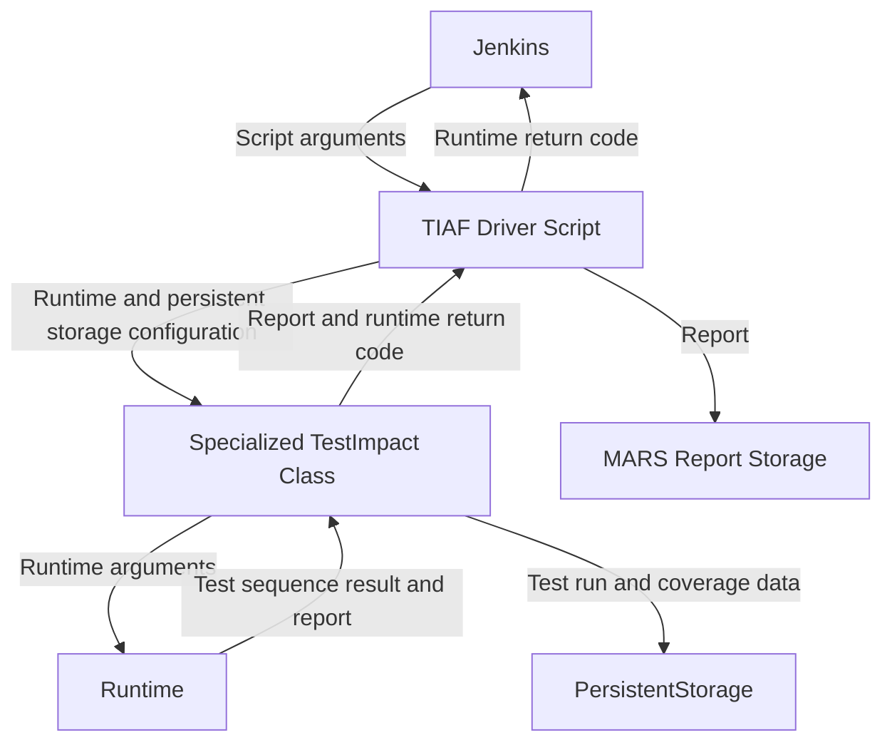

The integration of the TIAF native and Python runtimes into O3DE's Automated Review (AR) is handled by a set of Python scripts that can be found [here](https://github.com/o3de/o3de/tree/development/scripts/build/TestImpactAnalysis). The driver script, `tiaf_driver.py`, is invoked by Jenkins with the arguments specified by [command line options](/docs/engine-dev/tools/tiaf/maintaining-tiaf/general-information#what-are-the-command-line-options-for-the-tiaf-ar-scripts). This script invokes the appropriate `TestImpact` class that in turn invokes the appropriate runtime executable with the given arguments. To debug the TIAF AR scripts, see the section [How do I reproduce a TIAF AR run locally?](/docs/engine-dev/tools/tiaf/maintaining-tiaf/debugging-tiaf#how-do-i-reproduce-a-tiaf-ar-run-locally).

## AR Integration Diagram

Below is a simplified diagram of the TIAF AR scripts and how they integrate into AR. As can be seen, form the perspective of Jenkins, the TIAF driver script is invoked and a return code returned (`0` for success, otherwise failures). Output regarding test failures, failures to launch test targets, and any other failures is outputted to the console. For more information about the return codes returned by the runtimes, see the section [Runtime return codes ](../../architectural-overview/runtime-frontend/#runtime-return-codes).

