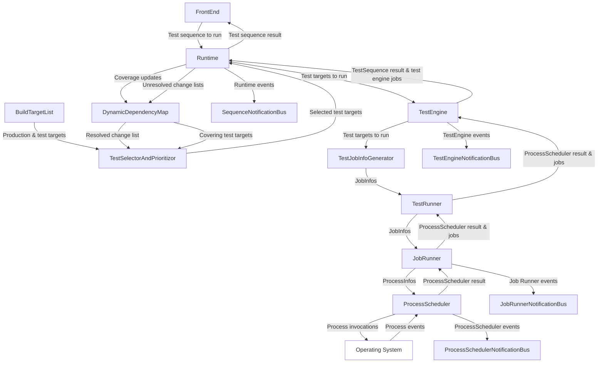
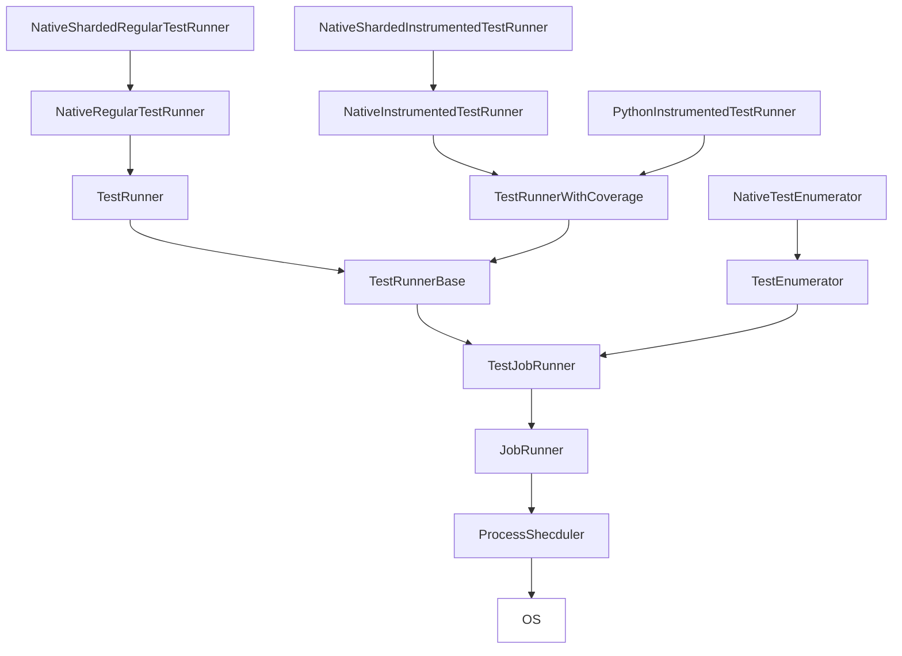

The runtime and front-end work together to present a unified interface to the user for selecting, prioritizing and running tests before presenting a report of the test results to the user. The runtime is responsible for performing the heavy lifting, whereas the front-end communicates the desired actions to the runtime and presents the results to the user.

## Simplified system diagram

Below is a simplified diagram of the subsystems that make up the runtime and front-end, and how they interact with one another (the native and Python specializations have been omitted for clarity):

## Artifacts

The artifacts are the "plain old data structures" (PODs) that are passed to and from the runtime. These artifacts come in two flavors: *static* artifacts, and *dynamic* artifacts. These artifacts are PODs to allow them to be passed to and from the runtime without the producers and consumers of these artifacts needing to be aware of how the runtime itself models the behavior of these artifacts. These artifacts are then used to instantiated more complex types that are used directly by the runtime via the various artifact *factories*. The location of these artifacts can be found [here](https://github.com/o3de/o3de/tree/development/Code/Tools/TestImpactFramework/Runtime/Common/Code/Include/Static/Artifact).

### Static Artifacts

Static artifacts are generated by the TIAF CMake scripts to model O3DE's build tree in memory. These artifacts are generated only once upon running CMake and persist between invocations of the runtime. These artifacts contain the information about each build target and its source file mappings, as well as information about whether each build target is a production target (build targets that are used to build the O3DE product itself) and test targets (build targets that contain the tests to be run for the production targets they cover).

### Dynamic Artifacts

Dynamic artifacts are artifacts that are produced by the runtime for a each invocation and may or may not persist between invocations. Such artifacts model the test results and coverage of test runs, having a near one to one mapping with the language and framework specific test result and coverage output of the test targets.

### Artifact Factories

The artifact factories take these raw POD artifacts and produce the types used internally by the runtime. The test target descriptor factory in particular consumes multiple artifacts per instantiated type due to the limitations of the ability to scrape information about the build tree at the CMake level.

## Test runner stack

Below is a diagram that demonstrates the test runner stack. It's something between a class diagram and an omnidirectional data flow diagram but so it's best not to take the diagram too literally. Rather, you can use it as the jumping off point for a given test runner and see how you will need to drill down in the code to reach the constituent classes that make up that test runner.

The following is a brief overview of each part of the stack (in bottom-up order) along with its function within the stack.

### ProcessScheduler

The `ProcessScheduler` handles the launching and lifecycle management of processes. The call to the scheduler to schedule its processes is blocking, although the client may optionally provide callbacks to listen to process state changes. It has no concept of higher level constructs such as build targets, test targets, tests etc. as it only handles the management of processes, whatever those processes may be. Although internally it manages the state of processes (either to be launched, in-flight, completed, etc.), it is stateless from the client's perspective and thus does not present the tracked state to the client. Rather, it has a number of callbacks for each process lifecycle event that the client can hook into and track as it sees fit.

#### Inputs

The `ProcessScheduler` accepts a list of processes to launch in the form of `ProcessInfos` and how many should be in flight concurrently at any given time, along with optional timeout limits for how long processes may be in flight and optional callbacks for the client to listen to process state changes. Each `ProcessInfo` contains a unique identifier provided by the client so that the client can determine which process is being referred to in the `ProcessScheduler`'s callbacks, along with details about how standard output/error produced from the process should be routed. The invocation of a process is specified by a command string to be executed by the operating system.

#### Process

The `ProcessScheduler` manages the entire lifecycle of the processes requested to be launched, including all communication with the operating system to invoke, track and terminate processes (as needed). As the state of each process changes, the appropriate callback is called (if provided by the client) with the final end of life callback containing any accumulated standard output/error if the process was instructed to route it to the client. The client returns a value to the `ProcessScheduler` to determine whether it should continue operating or shutdown.

#### Outputs

The `ProcessSchedulerResult` returns a `ProcessSchedulerResult` for the client to determine under what conditions the scheduler terminated. All other state must be tracked by the client through the callbacks.

#### FAQ

##### If the ProcessScheduler is blocking, will it lock up the thread its running on?

The `ProcessScheduler` yields control back to the client upon process state changes, as well as providing a tick callback (of a frequency determined by the client) to allow the client to not stall between process state changes. An interface is provided to the client to send messages to the `ProcessScheduler` to terminate specific processes, as well as returning a value to the `ProcessScheduler` to determine whether it should continue operating or shutdown.

#### I wish to support another platform, is the ProcessScheduler platform-specific?

In order to support new platforms, you need to override the `Process` class and implement the pure virtual methods for launching, terminating and querying the state of your platform-specific process.

### JobRunner

The `JobRunner` presents a simplified, stateful interface to the `ProcessScheduler`. Like the `ProcessScheduler`, it provides optional callbacks for the client to capture realtime standard output/error produced by processes, but instead it only provides a single lifecycle event callback upon the successful/unsuccessful process end of life event. Importantly, the `JobRunner` operates on the premise of each process performing work, whereupon the result of that work is a payload produced by the job. These payloads are specified in the form of an additional data structure that contains the meta-data about that payload. This is leveraged by the test runners whereupon the payloads produced are test and coverage artifacts in the form of files written to the disk by the test framework and coverage tool.

#### Inputs

The `JobRunner` accepts a set of list of `JobInfos` that specify the command string, payload meta-data and unique identifier for each job, as well as the job completion callback and optional timeout limits for each job. Additionally, a `PayloadMapProducer` function is provided by the client that is invoked for each successfully completed job once all of the jobs have completed. This `PayloadMapProducer` allows the client to take the payload meta-data for each job and consume the resulting payload artifacts. For the test runners, these `PayloadMapProducers` are the necessary deserialization functions for the test framework and coverage tool to consume their respective payload artifacts produced by each job.


The `JobInfos` to be run by the `JobRunner` are generated by a given runner's `JobInfoGenerator` higher up in the test runner stack. These generators have been omitted from the diagram above for clarity.


#### Process

The `JobRunner` hooks into the `ProcessScheduler` and tracks the state of each process before presenting a summary of each job to the client. This summary contains information about the start time, duration, job result, return code, etc. so that the test runners can interpret the result of a given test run. Once all jobs have completed, the `JobRunner` invokes the client-provided `PayloadMapProducer` for each job to generate the in-memory models of the work produced by each job.

#### Outputs

The `JobRunner` returns a `ProcessSchedulerResult` for the client to determine under what conditions the scheduler terminated as well as the job produced by each process invoked. These jobs contain the meta-data about the job (duration, return code, etc.) as well as the in-memory payload data structures produced by each job.

#### FAQ

##### Is it assumed that jobs produce files?

No, it is not assumed. As the information about the payload produced by jobs is provided by the client, it is up to you to determine what these payloads are and how they should be consumed.

##### Can I consume in-memory content (e.g. standard output/error)?

Yes, see above. As you can route the process output to the client, how you correlate that output and consume it is up to you.

##### Can file artifacts produced by jobs that do not necessarily correlate directly with jobs be consumed?

Yes, in fact the Python instrumented test runner does this. All you need to do is implement an appropriate `PayloadMapProducer` to handle this as the `PayloadMapProducer` is provided with all of the completed jobs so it is up to you how you will then produce the appropriate payload map.

##### The JobInfos contain the id and command string, yet the JobInfos themselves are template specialization, thus said ids and command strings are not interchangeable between different JobInfo types. Is this intentional?

Yes. Although under the hood the `ProcessScheduler` understands the same ids and command strings, the JobInfos are not interchangeable nor convertible between specializations in order enforce the idea that a given job id or command string is only valid for that job type and not to be accidentally mixed up with another job type (e.g. if attempting to use the same job callback for different job types).

### TestJobRunner

The `TestJobRunner` is an intermediary base class for the `TestEnumerator` and `TestRunnerBase` that interacts with the `JobRunner` that it owns. It contains no public interface and only the shared state between these higher level classes. As such, there are no inputs, process or outputs for this class.

### TestEnumerator

The `TestEnumerator` is the base class derived from the `TestJobRunner` class template and partially specializes it for test frameworks that support the enumeration of tests from the command line. Once enumerated, the results may optionally be cached on the disk and re-read by future enumerations instead of invoking the test framework enumeration from the command line. Enumerated tests are stored in-memory in `TestEnumeration` data structures that contain the fixtures and tests that belong to those fixtures, as well as information about whether those tests/fixtures are enabled or disabled in the test framework.

#### Inputs

The `TestEnumerator` accepts the same inputs as the `JobRunner`.

#### Process

The `TestEnumerator` wraps around the `JobRunner`'s call to run the jobs and injecting its `PayloadMapProducer` and `PayloadExtractor`. Optionally, it may either attempt to read enumerations from a cache file (specified by the client) and/or store the enumerations in said cache once enumerated.

#### Outputs

The `TestEnumerator` returns the same outputs as the `JobRunner`.

#### FAQ

##### You seem to have used the term `TestSuite` throughout the test and enumeration data structures instead of `TestFixture`. Why is this?

This was a regrettable oversight from the early development days when the nomenclature borrowed from GTest's naming conventions. These will be renamed `TestFixture` in a future PR as we also have the concept of actual test suites and the current name conflict can lead to confusion.

##### My test framework doesn't support test enumeration. Can I still implement a test enumerator?

You can, with varying degrees of success. One option would be to serialize the test runs as test enumerations and store them in the cache, only ever having your enumerator from said cache. It's not ideal, but it will work. Of course, this does mean that you cannot enumerate tests prior to running them in the past, so if your tests are unstable (i.e. tests are frequently being added/removed) then you could run into the situation where your cached enumerations are stale. However, determining stale caches is easy enough to do using the Dynamic Dependency Map (see: Dynamic Dependency Map).

### NativeTestEnumerator

The `NativeTestEnumerator` derives from the `TestEnumerator` and implements the `PayloadExtractor` method to extract enumeration artifacts produced by C++ tests using the GTest framework.

#### Inputs

The `NativeTestEnumerator` accepts the same inputs as the `TestEnumerator`.

#### Process

The `NativeTestEnumerator` extracts enumeration payloads from GTest XML file enumeration artifacts.

#### Outputs

The `NativeTestEnumerator` returns the same outputs as the `TestEnumerator`.

#### FAQ

##### What is the purpose of the NativeTestEnumerator?

The test enumerations produced by the `NativeTestEnumerator`  are used by the native sharded test runners to optimize the native test run times by breaking test targets into sub-tests and running them in parallel.

##### Why is there no PythonTestEnumerator?

At the time of writing, it is not possible to arbitrarily run Python tests in parallel as the Editor does not fully support this feature. Should this shortcoming be resolved in the future, a `PythonTestEnumerator` will be implemented.

### TestRunnerBase

The `TestRunnerBase` is the first level of the test runner stack to have awareness of the concept of running tests. It is an abstract class that wraps around the `TestJobRunner` to present an interface for running tests, with virtual and pure virtual methods for test runners to implement the `PayloadMapProducer`s to extract their respective payloads from the completed jobs. Higher up in the stack, the `TestRunner` and `TestRunnerWithCoverage` specialize this class to implement their regular and instrumented test run behavior.

#### Inputs

The `TestRunnerBase` accepts the same inputs as the `JobRunner`.

#### Process

The `TestRunnerBase` wraps around the `JobRunner`'s call to run the jobs and injecting its `PayloadMapProducer` and `PayloadExtractor`, with the latter being implemented by the derived classes.

#### Outputs

The `TestRunnerBase` returns the same outputs as the `JobRunner`.

#### FAQ

##### Is the TestRunnerBase platform/language/test framework/coverage tool specific?

It is neither. Although it has a nebulous concept of tests, it still operates using command strings to invoke jobs and delegates all payload consumption to the client. It doesn't know what a language, test framework or coverage tool is, all it knows is that a test can be invoked from the command line and that the client can consume the payload(s) of that test.

##### I wish to support a new language/test framework/coverage tool. Is this possible?

Yes, as the current stack supports both C++ and Python tests, each of which use different test frameworks and coverage tools. If your tests can be invoked from a command line string and they can produce test result and/or coverage data that can be consumed post-completion, your language/test framework/coverage tool can be supported.

### TestRunner

The `TestRunner` is derived from the `TestRunnerBase` class template that provides the `TestRun` template parameter to `TestRunnerBase`. This class provides no other functionality and acts as a partial template specialization for both the native and Python test runners.

#### Inputs

The `TestRunner` accepts the same inputs as the `TestRunnerBase`.

#### Process

The `TestRunner` does not do any specific processing.

#### Outputs

The `TestRunner` returns the same outputs as the `TestRunnerBase`.

### NativeRegularTestRunner

The `NativeRegularTestRunner` derives from the `TestRunner` and implements the `PayloadExtractor` to handle the extraction of GTest test run artifacts.

#### Inputs

The `NativeRegularTestRunner` accepts the same inputs as the `TestRunner`.

#### Process

The `NativeRegularTestRunner` extracts test run payloads from GTest XML files.

#### Outputs

The `NativeRegularTestRunner` returns the same outputs as the `TestRunner`.

#### FAQ

##### Why is there no `PythonRegularTestRunner` like the native test runner counterparts?

Unlike the native test runners, there is no distinction between a regular test runner and an instrumented test runner as Python tests are always run with the `PythonCoverage` gem enabled. As such, it is assumed that all Python tests are instrumented tests, hence no need for a regular test runner counterpart.

### TestRunnerWithCoverage

The `TestRunnerWithCoverage` is derived from the `TestRunnerBase` class template that provides the `TestRun` and `CoverageArtifact` template parameter as a pair to `TestRunnerBase`. This class provides no other functionality and acts as a partial template specialization for both the native and Python instrumented test runners.

#### Inputs

The `TestRunnerWithCoverage` accepts the same inputs as the `TestRunnerBase`.

#### Process

The `TestRunnerWithCoverage` does not do any specific processing.

#### Outputs

The `TestRunnerWithCoverage` returns the same outputs as the `TestRunnerBase`.

### PythonInstrumentedTestRunner

The `PythonInstrumentedTestRunner` derives from the `TestRunnerWithCoverage` and implements the `PayloadExtractor` to handle the extraction of PyTest test run artifacts and the PyCoverage artifacts from the `PythonCoverage` gem in the `AutomatedTesting` project.

#### Inputs

The `PythonInstrumentedTestRunner` accepts the same inputs as the `TestRunnerWithCoverage`.

#### Process

The `PythonInstrumentedTestRunner` extracts test run payloads from PyTest XML file test run artifacts. For the `ModuleCoverage` artifacts, each test fixture has a dedicated folder that is obtained through the `GetCoverageArtifactPath` call from a given `JobInfo` whereupon the folder is scanned for all `.pycoverage` files which in turn are extracted into a `PythonModuleCoverage` artifact.

#### Outputs

The `PythonInstrumentedTestRunner` returns the same outputs as the `TestRunnerWithCoverage`.

### NativeInstrumentedTestRunner

The `NativeInstrumentedTestRunner` derives from the `TestRunnerWithCoverage` and implements the `PayloadExtractor` to handle the extraction of GTest test run artifacts and the JUnit coverage artifacts.

#### Inputs

The `NativeInstrumentedTestRunner` accepts the same inputs as the `TestRunnerWithCoverage`.

#### Process

The `NativeInstrumentedTestRunner` extracts test run payloads from GTest XML files and coverage payloads from JUnit coverage artifacts produced by OpenCppCoverage.

#### Outputs

The `NativeInstrumentedTestRunner` returns the same outputs as the `TestRunnerWithCoverage`.

### Native sharded test runners

The `NativeShardedRegularTestRunner` and `NativeShardedInstrumentedTestRunner` are an optimization that split opted-in test targets into shards to distribute over the available hardware cores for increased performance. They do this transparently by presenting a similar interface to the standard test runners. They do this by feeding the sharded test target `JobInfos` to said standard `NativeRegularTestRunner` and `NativeInstrumentedTestRunner` test runners (where there will potentially be multiple `JobInfos` per test target) before consolidating the output of said standard test runners into one `Job` per test target. Both of the sharded test runners derive from `NativeShardedTestRunnerBase` (not shown in the diagram above) and implement the `ConsolidateSubJobs` function. 

#### Inputs

The native sharded test runners accept `ShardedTestJobInfos` as their input where each `ShardedTestJobInfo` contains information about the parent job that is presented to the user and the sharded sub-jobs that are fed to the standard test runners.

#### Process

The native sharded test runners wait until the sharded sub-jobs of a given parent job are complete before presenting the appropriate notification to the user. Once all sharded sub-jobs are complete, the native sharded test runners consolidate the sharded sub-jobs back into the parent job and present these parent jobs to the user, as if the sharding never occurred.

#### Outputs

The native sharded test runners return the same outputs as the  `NativeRegularTestRunner` and `NativeInstrumentedTestRunner`.

#### FAQ

##### Why are there no Python sharded test runners like the native shardedtest runner counterparts?

As the python tests cannot be arbitrarily executed in parallel at the test level, there is no need for sharded Python test runners.