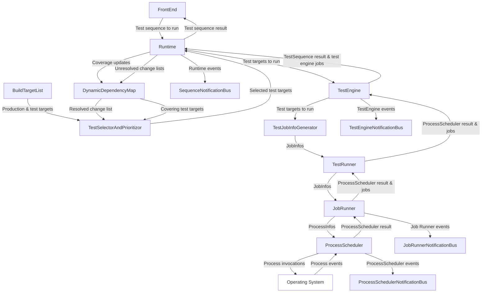

```mermaid
flowchart TD
    FrontEnd -->|Test sequence to run| Runtime
    Runtime --> |Test sequence result| FrontEnd
    Runtime --> |Test targets to run| TestEngine
    Runtime --> |Coverage updates| DynamicDependencyMap
    Runtime --> |Unresolved change lists| DynamicDependencyMap
    Runtime --> |Runtime events| SequenceNotificationBus
    BuildTargetList --> |Production & test targets| TSAP[TestSelectorAndPrioritizor]
    DynamicDependencyMap --> |Resolved change list| TSAP
    DynamicDependencyMap --> |Covering test targets| TSAP
    TSAP --> |Selected test targets| Runtime
    TestEngine --> |Test targets to run| TestJobInfoGenerator
    TestJobInfoGenerator --> |JobInfos| TestRunner
    TestEngine --> |TestSequence result & test engine jobs| Runtime
    TestEngine --> |TestEngine events| TestEngineNotificationBus
    TestRunner --> |ProcessScheduler result & jobs| TestEngine
    TestRunner --> |JobInfos| JobRunner
    JobRunner --> |ProcessScheduler result & jobs| TestRunner
    JobRunner --> |ProcessInfos| ProcessScheduler
    JobRunner --> |Job Runner events| JobRunnerNotificationBus
    ProcessScheduler --> |ProcessScheduler result| JobRunner
    ProcessScheduler --> |Process invocations| OS[Operating System]
    ProcessScheduler --> |ProcessScheduler events| ProcessSchedulerNotificationBus
    OS --> |Process events| ProcessScheduler
    style OS fill:#fff
```